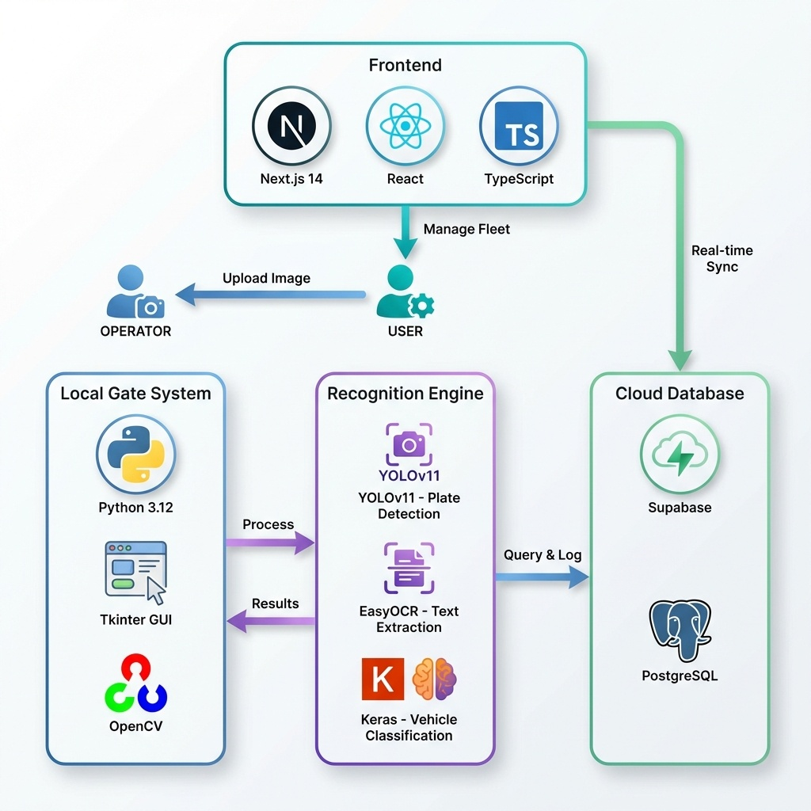

# 🌟 Gold Award Winner: 🚗 ANPR Vehicle Access Control System

An AI-powered Automatic Number Plate Recognition (ANPR) system for vehicle access control with fraud detection capabilities.



## 🌟 Features

- **License Plate Detection** - YOLOv11-based plate detection with OCR text extraction
- **Vehicle Classification** - AI-powered color and make/model recognition
- **Real-time Access Control** - Instant gate access decisions
- **Fraud Detection** - Identify mismatched vehicle data and suspicious access attempts
- **Admin Dashboard** - Modern web interface for fleet management
- **Cloud Sync** - Real-time data synchronization with Supabase

## 🏗️ System Architecture

| Component | Technology | Purpose |
|-----------|------------|---------|
| **Frontend** | Next.js 14, React, TypeScript | Admin Dashboard UI |
| **Local System** | Python 3.12, Tkinter, OpenCV | Gate control interface |
| **Plate Detection** | YOLOv11 (Ultralytics) | License plate localization |
| **OCR** | EasyOCR | Text extraction from plates |
| **Classification** | TensorFlow/Keras | Vehicle color & make prediction |
| **Database** | Supabase (PostgreSQL) | Cloud storage & real-time sync |

## 📁 Project Structure

```
fyp2/
├── admin-dashboard/          # Next.js Admin Dashboard
│   ├── app/                  # Next.js app router pages
│   │   ├── page.tsx         # Dashboard home
│   │   ├── register/        # Vehicle registration
│   │   ├── analytics/       # Fleet analytics
│   │   └── fraud/           # Fraud detection
│   ├── components/          # React components
│   └── lib/                 # Supabase client
│
├── local_system/            # Python Gate Control System
│   ├── main.py              # Main application entry
│   ├── ui.py                # Tkinter UI
│   ├── database.py          # Supabase integration
│   ├── config.py            # Configuration
│   └── recognition/         # AI recognition modules
│       ├── plate_detector.py
│       ├── ocr_engine.py
│       └── vehicle_classifier.py
│
└── supabase_schema.sql      # Database schema
```

## 🚀 Getting Started

### Prerequisites

- Python 3.10+
- Node.js 18+
- Supabase account

### 1. Clone the Repository

```bash
git clone https://github.com/ixgnoy/final-year-project.git
cd final-year-project
```

### 2. Set Up Supabase

1. Create a new Supabase project
2. Run the SQL schema in `supabase_schema.sql`
3. Copy your project URL and anon key

### 3. Local System Setup

```bash
# Create virtual environment
cd local_system
python -m venv venv
venv\Scripts\activate  # Windows
# source venv/bin/activate  # Linux/Mac

# Install dependencies
pip install -r requirements.txt

# Configure environment
cp .env.example .env
# Edit .env with your Supabase credentials

# Download ML models (see Models section below)

# Run the system
python main.py
```

### 4. Admin Dashboard Setup

```bash
cd admin-dashboard

# Install dependencies
npm install

# Configure environment
cp .env.example .env.local
# Edit .env.local with your Supabase credentials

# Run development server
npm run dev
```

Access dashboard at: http://localhost:3000

## 🤖 ML Models

The following models need to be downloaded separately (not included due to size):

### License Plate Detection (YOLOv11)

```bash
# Clone the model repository
git clone https://huggingface.co/morsetechlab/yolov11-license-plate-detection
```

### Vehicle Classification Models

Download from Teachable Machine or train your own:
- Color classifier: `converted_keras/keras_model.h5`
- Make/Model classifier: `car-model-recog/keras_model.h5`

## 📊 Database Schema

### Vehicles Table
```sql
CREATE TABLE vehicles (
    id SERIAL PRIMARY KEY,
    plate_number VARCHAR(20) UNIQUE NOT NULL,
    owner_name VARCHAR(100),
    make_model VARCHAR(100),
    color VARCHAR(50),
    created_at TIMESTAMP DEFAULT NOW()
);
```

### Access Logs Table
```sql
CREATE TABLE access_logs (
    id SERIAL PRIMARY KEY,
    timestamp TIMESTAMP DEFAULT NOW(),
    plate_number VARCHAR(20),
    detected_color VARCHAR(50),
    detected_model VARCHAR(100),
    plate_matched BOOLEAN,
    color_matched BOOLEAN
);
```

## 🔒 Security Notes

- Never commit `.env` files to version control
- Use environment variables for all secrets
- The `.gitignore` file excludes sensitive data

## 📸 Screenshots

### Gate Control System
- Upload vehicle images
- Real-time plate detection and OCR
- Instant access decisions

### Admin Dashboard
- Fleet management
- Vehicle registration
- Analytics and fraud detection

## 🛠️ Tech Stack

**Backend:**
- Python 3.12
- OpenCV
- TensorFlow/Keras
- EasyOCR
- Ultralytics YOLOv11

**Frontend:**
- Next.js 14
- React 18
- TypeScript
- Supabase Client

**Database:**
- Supabase (PostgreSQL)
- Real-time subscriptions

## 📝 License

This project is part of a Final Year Project (FYP) for educational purposes.

## 👤 Author

- GitHub: [@ixgnoy](https://github.com/ixgnoy)

---

Made with ❤️ for Final Year Project
